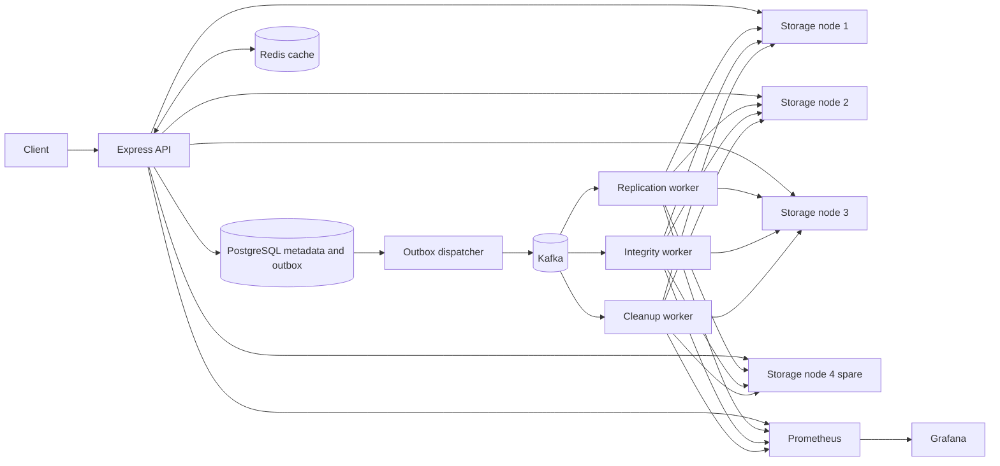
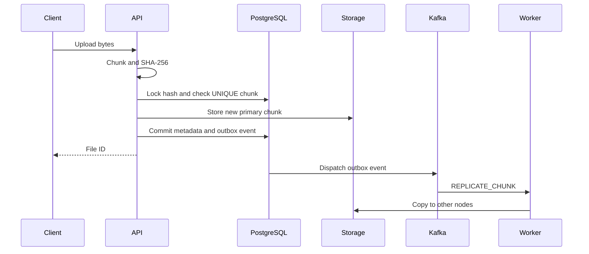
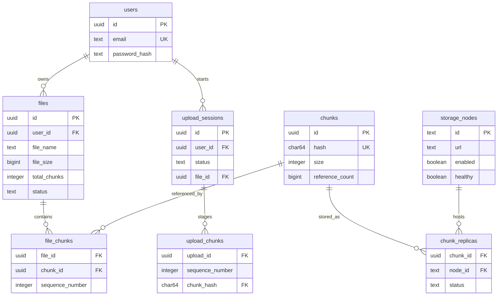

# Distributed File Backup System

A compact backup service built with Node.js, TypeScript, Express, PostgreSQL, Redis, Kafka, and four filesystem storage nodes. It stores file metadata in PostgreSQL and chunk bytes on storage nodes. SHA-256 identifies chunks, so identical content can be shared across files. A Kafka worker creates replicas after the primary write returns.

> **Run status:** Verified on a live Docker Compose stack: build, lint, unit tests, deduplication, node failover and replacement, cleanup, resumable upload, ownership, Redis fallback, integrity repair, Prometheus scrape targets, and Grafana provisioning. See [Verification](#verification). No load benchmark has been run.

## Architecture



Each container has its own process. Storage nodes have separate persistent volumes. The fourth node is spare capacity: with replication factor three, three total nodes cannot restore three healthy replicas while one is down.

## Upload and download

The direct upload endpoint accepts an `application/octet-stream` body and `Content-Length`. It reads the request as a stream, splits it into configurable 5 MiB chunks, hashes one chunk at a time, and writes each new chunk to a primary node. The upload session records chunk order. Completing a session atomically creates the file and file-to-chunk rows and increments reference counts. An outbox event is committed with a new chunk so a dispatcher can publish it to Kafka. The upload response does not wait for replicas.

The download endpoint reads ordered file chunks from PostgreSQL, finds active replicas on enabled healthy nodes, checks SHA-256 while reading, and streams one chunk at a time to the client. It tries another replica after a read or hash failure. A missing required chunk returns `503 CHUNK_UNAVAILABLE` before streaming if metadata shows no healthy replica.



## Deduplication and consistency

`chunks.hash` is unique. Staging takes a PostgreSQL transaction advisory lock keyed by the hash before checking for an existing chunk. Only the first writer stores a primary; later writers reuse it. Completing a file increments `reference_count` by the number of times each chunk appears in that file. Deletion decrements by the same count in a transaction. The cleanup worker checks the count again before deleting bytes. An open upload session keeps a zero-reference chunk from being cleaned prematurely.

The PostgreSQL outbox prevents a committed chunk from losing its replication request if Kafka is briefly unavailable. Publishing is at least once, so workers use `UNIQUE(chunk_id,node_id)` and idempotent storage writes. A replay can produce another event but does not create another logical replica.

## Replication and recovery

The configured default is three healthy copies. Node selection rotates a sorted healthy node list using the chunk hash. The replication worker reads a healthy source, verifies its hash, and copies missing replicas to distinct nodes. An API health poll runs every 15 seconds, updates node availability, and schedules under-replicated chunks. Admin disable/enable endpoints trigger a scan immediately. Download excludes disabled or unhealthy nodes. Re-enabling a node does not automatically rebalance excess copies; see limitations.

Verification is asynchronous: `POST /api/files/:id/verify` queues one Kafka event per chunk. The integrity worker hashes available replicas, marks bad ones `CORRUPTED`, then repairs them from a healthy copy. Workers retry transient failures with 1, 2, and 4 second delays by default; exhausted events go to `dead-letter-events` with `attemptCount`, `lastError`, and `lastAttemptAt`.

## Metadata schema



Migrations live in `migrations/` and are applied by the one-shot `migrate` container under a PostgreSQL advisory lock. `outbox` holds pending Kafka events. PostgreSQL stores no file bytes. Redis caches file metadata with TTL 600 seconds by default; cache failures fall back to PostgreSQL. Cache keys include the user ID to preserve ownership boundaries.

## API

All public file and upload routes require `Authorization: Bearer <JWT>`. Internal routes require `x-internal-token`.

| Method | Path                                  | Purpose                                                |
| ------ | ------------------------------------- | ------------------------------------------------------ |
| POST   | `/api/auth/register`                  | Create user                                            |
| POST   | `/api/auth/login`                     | Get JWT                                                |
| GET    | `/api/auth/me`                        | Current user                                           |
| POST   | `/api/files/upload`                   | Stream whole file; `x-file-name` and octet-stream body |
| GET    | `/api/files`                          | List owned files                                       |
| GET    | `/api/files/:id`                      | Owned file metadata                                    |
| GET    | `/api/files/:id/download`             | Stream original bytes                                  |
| DELETE | `/api/files/:id`                      | Delete file and queue cleanup                          |
| POST   | `/api/files/:id/verify`               | Queue integrity checks                                 |
| POST   | `/api/uploads/initiate`               | `{fileName,fileSize}`; returns session                 |
| POST   | `/api/uploads/:id/chunks?sequence=N`  | Upload one octet-stream chunk                          |
| GET    | `/api/uploads/:id/status`             | Uploaded and missing sequence numbers                  |
| POST   | `/api/uploads/:id/complete`           | Atomically publish file                                |
| GET    | `/internal/storage-nodes`             | List nodes                                             |
| GET    | `/internal/storage-nodes/:id`         | Inspect node                                           |
| POST   | `/internal/storage-nodes/:id/disable` | Stop using node                                        |
| POST   | `/internal/storage-nodes/:id/enable`  | Resume using node                                      |
| GET    | `/internal/chunks/:hash`              | Inspect reference count and replicas                   |
| GET    | `/health`                             | API liveness                                           |
| GET    | `/metrics`                            | Prometheus metrics                                     |

Storage nodes expose token-protected `PUT`, `GET`, and `DELETE /internal/chunks/:hash`, plus `GET /internal/health`.

Errors use `{ "error": { "code": "...", "message": "..." } }`. Request IDs appear in `X-Request-Id` and JSON logs. Authentication uses bcrypt and a 12-hour JWT. The API enforces a file size limit, exact chunk lengths for resumable uploads, Zod validation, and a simple per-process IP rate limit.

## Docker setup

Requirements: Docker Desktop or Docker Engine with Compose. On Windows PowerShell:

On first setup, create `.env` and replace `POSTGRES_PASSWORD`, `GRAFANA_PASSWORD`, `JWT_SECRET`, and `INTERNAL_TOKEN` with separate random values. Run the random-value command below once per secret. Set the password in `DATABASE_URL` to the same value as `POSTGRES_PASSWORD` for commands run directly on the host. Keep your existing `.env` on later runs: replacing it can make its password disagree with the existing PostgreSQL volume.

```powershell
if (-not (Test-Path .env)) { Copy-Item .env.example .env }
node -e "console.log(require('node:crypto').randomBytes(32).toString('hex'))"
```

After editing `.env`, start the stack:

```powershell
docker compose up --build -d
docker compose ps
docker compose logs -f api replication-worker
```

The stack runs PostgreSQL, Redis, a single-node KRaft Kafka broker, a migration job, the API, four storage nodes, three workers, Prometheus, and Grafana. The Kafka container configuration follows the [official Apache Kafka Docker examples](https://github.com/apache/kafka/tree/trunk/docker/examples). Compose volumes retain metadata and chunk bytes. `docker compose down` stops containers; `docker compose down -v` also removes all stored data.

The API is at `http://localhost:3000`, Prometheus at `http://localhost:9090`, and Grafana at `http://localhost:3001`. Sign in to Grafana with `GRAFANA_USER` and `GRAFANA_PASSWORD` from `.env`. The provisioned **Distributed Backup System** dashboard shows API rate and latency, deduplication ratio, worker activity, replication failures, and node health.

## Demo commands

PowerShell example after starting the stack:

```powershell
$email = "demo-$(Get-Random)@example.com"
$body = @{ email = $email; password = 'demo-password-123' } | ConvertTo-Json
$registered = Invoke-RestMethod -Method Post -Uri http://localhost:3000/api/auth/register -ContentType 'application/json' -Body $body
$loggedIn = Invoke-RestMethod -Method Post -Uri http://localhost:3000/api/auth/login -ContentType 'application/json' -Body $body
$token = $loggedIn.token
node -e "require('node:fs').writeFileSync('demo.bin', require('node:crypto').randomBytes(6*1024*1024))"
curl.exe -sS -X POST http://localhost:3000/api/files/upload -H "Authorization: Bearer $token" -H 'Content-Type: application/octet-stream' -H 'x-file-name: demo.bin' --data-binary '@demo.bin'
# Repeat the same upload: chunks are reused.
$files = Invoke-RestMethod -Uri http://localhost:3000/api/files -Headers @{ Authorization = "Bearer $token" }
$fileId = $files[0].id
curl.exe -sS http://localhost:3000/api/files/$fileId/download -H "Authorization: Bearer $token" -o restored.bin
Get-FileHash demo.bin -Algorithm SHA256
Get-FileHash restored.bin -Algorithm SHA256
```

To inspect deduplication and replicas, calculate the first chunk hash and call the internal endpoint:

```powershell
$hash = node -e "let d=require('node:fs').readFileSync('demo.bin');console.log(require('node:crypto').createHash('sha256').update(d.subarray(0,5242880)).digest('hex'))"
$internal = (Get-Content .env | Where-Object { $_ -like 'INTERNAL_TOKEN=*' }).Split('=')[1]
Invoke-RestMethod -Uri "http://localhost:3000/internal/chunks/$hash" -Headers @{ 'x-internal-token' = $internal }
```

The `reference_count` rises after the duplicate upload while the number of active replicas stays near three. Wait for replication, then disable one of the active node IDs and download again:

```powershell
Invoke-RestMethod -Method Post -Uri http://localhost:3000/internal/storage-nodes/node-1/disable -Headers @{ 'x-internal-token' = $internal }
curl.exe -sS http://localhost:3000/api/files/$fileId/download -H "Authorization: Bearer $token" -o recovered.bin
Invoke-RestMethod -Uri "http://localhost:3000/internal/chunks/$hash" -Headers @{ 'x-internal-token' = $internal }
Invoke-RestMethod -Method Post -Uri http://localhost:3000/internal/storage-nodes/node-1/enable -Headers @{ 'x-internal-token' = $internal }
```

Within the health poll and worker delay, a spare node should hold the replacement copy. Compare hashes of `demo.bin` and `recovered.bin`. Delete one file and inspect the still-positive reference count; delete the second and wait for `/internal/chunks/:hash` to return 404. To simulate a real process failure, `docker compose stop storage-node-1` and later `docker compose start storage-node-1`.

## Resumable uploads

Call `POST /api/uploads/initiate` with exact `fileSize`. Split the file into `CHUNK_SIZE_BYTES` pieces; send each piece to `POST /api/uploads/:id/chunks?sequence=1` with `Content-Type: application/octet-stream`. `GET /api/uploads/:id/status` returns `uploadedChunks` and `missingChunks`. Repeating a matching chunk is safe. Complete only after all chunks are present. Idle open sessions expire after 24 hours. Completed sessions retain status, but individual upload-chunk staging rows are removed once the file is published.

## Verification

```powershell
npm.cmd ci
npm.cmd run build
npm.cmd run lint
npm.cmd test
docker compose --env-file .env.example config --quiet
# With the stack running and INTERNAL_TOKEN set to the value in .env:
$env:RUN_INTEGRATION = '1'
$env:INTERNAL_TOKEN = $internal
npm.cmd test -- --runTestsByPath tests/integration.test.ts
```

The integration tests register and log in, upload the same 6 MiB file twice, check deduplication, wait for three replicas, disable a node, download through another, wait for recovery, and check reference-count cleanup. They also test concurrent deduplication, resumable uploads, ownership, reading metadata while Redis is stopped, and repair of a deliberately corrupted replica. They need the Compose stack and are skipped during the default unit test run.

Optional load testing uses [k6](https://grafana.com/docs/k6/latest/):

```powershell
New-Item -ItemType Directory -Force load/fixtures | Out-Null
node -e "require('node:fs').writeFileSync('load/fixtures/load.bin', require('node:crypto').randomBytes(262144))"
$env:TOKEN = $token
k6 run load/k6.js
```

Observe k6 throughput, latency, and error rate alongside Prometheus resource metrics. No benchmark numbers are included because none have been measured on a running stack.

## Design trade-offs and limitations

- PostgreSQL transactions and constraints keep file, chunk, and replica relationships consistent. Redis only accelerates reads; a Redis outage causes database fallback.
- Kafka decouples replication, verification, and cleanup from request latency. A one-broker local setup is itself a single point of failure; the outbox retains pending events until Kafka recovers.
- Fixed-size chunks make resume and deduplication straightforward, though shifted bytes change all following chunk hashes. Rolling-content chunking would deduplicate edits better.
- Filesystem storage nodes demonstrate physical distribution without a cloud account. Production storage would need TLS, stronger node authentication, capacity-aware placement, and object-storage durability.
- The API keeps one chunk in memory at a time. The direct upload endpoint requires `Content-Length`; clients that cannot provide it should use resumable uploads.
- A disabled node's physical data is retained. Re-enabling it may temporarily leave more than three active replicas; automatic rebalancing is not implemented.
- Rate limiting is per API process. The local single Kafka broker and PostgreSQL server are not highly available. No encryption at rest or multi-region durability is implemented.
- A sudden process crash between storage write and metadata commit can leave an orphan physical chunk. A periodic orphan scanner would close this gap.

Future work: consistent hashing, S3 backend, Kubernetes, multi-region replication, encryption, erasure coding, versioning, garbage-collection optimization, load balancing, rebalancing, tracing, and autoscaling.
